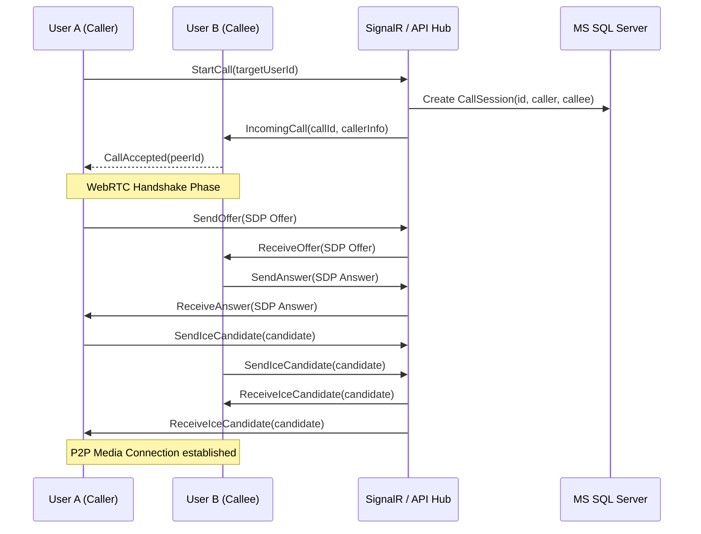

# OIS Meet: Real-Time Calling Architecture

This document outlines the architecture for a real-time voice and video calling system (OIS Meet) built with Angular 17, .NET Core, SignalR, and WebRTC.

## 1. System Architecture

The system follows a hybrid architecture, using **P2P WebRTC** for 1:1 calls and an **SFU (Selective Forwarding Unit)** like LiveKit or Mediasoup for group calls.

### Components
- **Angular Frontend**: Handles media stream capture, WebRTC peer management, and signaling state.
- **.NET Core API**: Manages call sessions, security tokens, and user metadata.
- **SignalR Hub**: Serves as the signaling channel for ICE candidate exchange, offers, and answers.
- **MS SQL Server**: Persists call history, participant states, and presence.
- **SFU (LiveKit)**: Manages media distribution for group calls (> 2 participants).
- **ICE Servers (STUN/TURN)**: Facilitates NAT traversal.

---

## 2. Call Flow (Signaling)

### 1:1 Call Sequential Diagram


---

## 3. Database Schema

### SQL Server Tables

```sql
-- Table: Users (Basic metadata for presence)
CREATE TABLE Users (
    Id UNIQUEIDENTIFIER PRIMARY KEY,
    DisplayName NVARCHAR(100),
    Email NVARCHAR(255),
    Status NVARCHAR(20) DEFAULT 'Offline', -- Online, Busy, DND, Offline
    LastSeen DATETIME2
);

-- Table: CallSessions
CREATE TABLE CallSessions (
    Id UNIQUEIDENTIFIER PRIMARY KEY,
    CallType NVARCHAR(10), -- 'Audio', 'Video'
    StartTime DATETIME2 DEFAULT GETUTCDATE(),
    EndTime DATETIME2,
    Status NVARCHAR(20), -- 'Initiated', 'Active', 'Ended', 'Missed'
    CreatedBy UNIQUEIDENTIFIER REFERENCES Users(Id)
);

-- Table: CallParticipants
CREATE TABLE CallParticipants (
    Id UNIQUEIDENTIFIER PRIMARY KEY,
    CallId UNIQUEIDENTIFIER REFERENCES CallSessions(Id),
    UserId UNIQUEIDENTIFIER REFERENCES Users(Id),
    JoinedAt DATETIME2,
    LeftAt DATETIME2,
    IsOwner BIT DEFAULT 0
);
```

---

## 4. API Contract Definitions

### Authentication & Tokens
- `GET /api/collaboration/calls/{id}/token`: Generates a JWT token for SFU (LiveKit) access.
- `GET /api/presence/status`: Long-polling or WebSocket sync for user presence.

### Call Management
- `POST /api/collaboration/calls/start`: Initiates a call session.
  - Body: `{ targetUserId: string, callType: 'Audio' | 'Video' }`
- `POST /api/collaboration/calls/{id}/join`: User joins an existing group call.
- `POST /api/collaboration/calls/{id}/end`: Terminates the session and logs end time.

---

## 5. ICE Candidate & Signaling Hub

The SignalR Hub (`CallHub.cs`) facilitates real-time signaling.

```csharp
public class CallHub : Hub 
{
    public async Task SendOffer(string targetUserId, object offer) 
    {
        await Clients.User(targetUserId).SendAsync("ReceiveOffer", Context.UserIdentifier, offer);
    }
    
    public async Task SendIceCandidate(string targetUserId, object candidate) 
    {
        await Clients.User(targetUserId).SendAsync("ReceiveIceCandidate", Context.UserIdentifier, candidate);
    }
}
```

---

## 6. Scaling & Security

### Scaling Strategy
- **SignalR Backplane**: Use Redis to synchronize hub messages across multiple .NET server instances.
- **SFU Clustering**: Deploy SFU nodes globally (Edge locations) to minimize latency.
- **SQL Sharding**: For call logs if volume exceeds millions of entries per month.

### Security
- **DTLS/SRTP**: Mandatory encryption for WebRTC media streams.
- **JWT-based Hub Auth**: Secure SignalR connections using Bearer tokens.
- **TURN Auth**: Short-lived credentials for TURN server access (3DES or similar).

---

## 7. Reconnection Handling
- **Exponential Backoff**: For Signaling (SignalR) reconnection.
- **ICE Restart**: WebRTC `iceRestart` flag when network changes (e.g., Switching from WiFi to 4G).
- **Heartbeat**: Presence tracking via Redis key expiry for automatic "Offline" status mapping.
